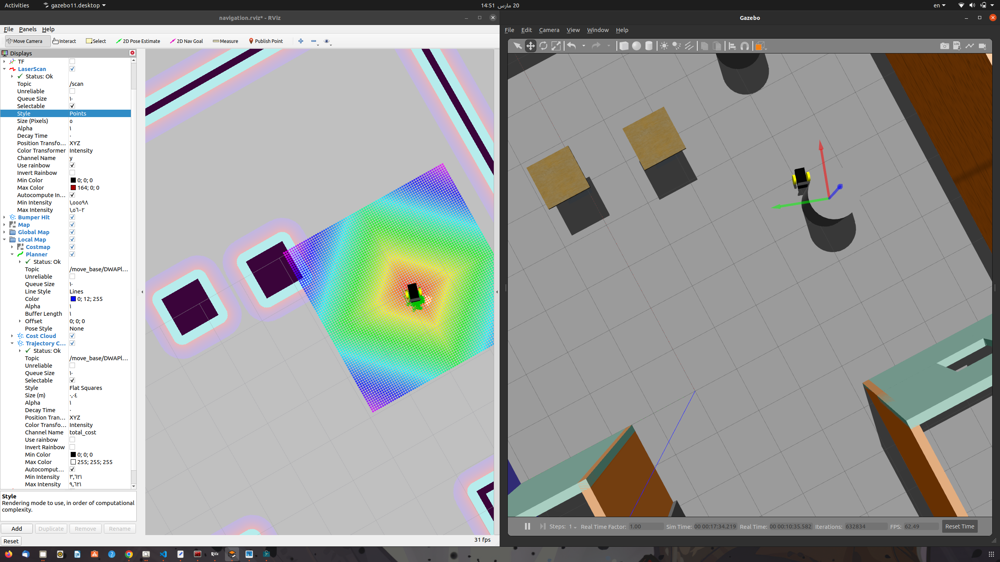
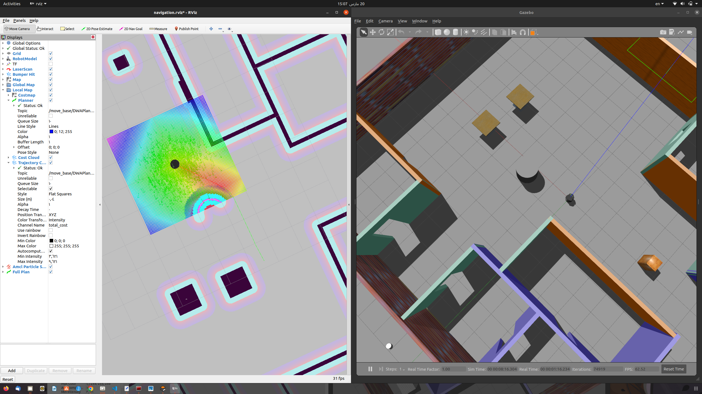

# kinect_robot navigation test using kinect camera  compered to turtlebot 2 navigation
# I used the same navigation parameters for turtlebot 2 and this leads to good localization and navigation result
# But the robot can't detect any change happens in the environment, the laser detect it but the navigation stack dosn't change the global path to avoid collision
#compared to the turtlebot 2 which can handle any change the environment in most cases even in case multiple changes around

# The robot structure has only the main base_footprint, right and left wheels, 2 custer wheels, the kinect camera and the required gazebo plugins.


##Note
## In fact i don't realize the reason that kinect_robot cann't handle changes in the environment even after alot of tunning 
## So i roll back to the turtlebot 2 parameters again and still trying to recognize the reason how to solve this scenario


### To launch the kinect_robot use one of this two methods
## from launch folder run

```console
     chmod +x ./robot.sh
```
```console
     ./robot.sh 
```

## or

```console
    $ roslaunch robot_description gazebo.launch 
```

## then

```console
    $ roslaunch robot_description navigation.launch 
```
##kinect navigation result 
## as shown in image, the robot navigation and localization is ok  >>> but cannot update the global path according to changes in the envronment.





### To launch the turtlebot 2 use one of this two methods
## Note = you must have turtlebot 2 installed in your catkin_ws to run these launch files
## from launch folder run

```console
    $ chmod +x ./turtlebot.sh
```
```console
    $ ./turtlebot.sh 
```

## or

```console
    $ roslaunch turtlebot_gazebo turtlebot_world.launch world_file:=$(rospack find robot_description)/worlds/Office.world
```

## then

```console
    $ roslaunch turtlebot_gazebo amcl_demo.launch map_file:=$(rospack find robot_description)/maps/map.yaml
```


```console
    $ roslaunch turtlebot_rviz_launchers view_navigation.launch
```


